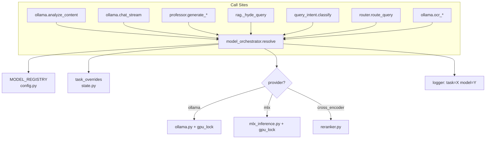

# Jarvis Fase 1 — Model Orchestrator + Dependencias + Health Check

Centralizar la selección de modelos IA por subtarea en un orquestador único, corregir dependencias faltantes, y añadir visibilidad del estado de modelos en el dashboard.

---

## User Review Required

> [!IMPORTANT]
> **Alcance del Professor/Flashcards:** Tu plan menciona "o directamente no incluyas esta funcionalidad por ahora". En esta Fase 1, el refactor del professor solo cambia **de dónde toma el modelo** (orchestrator en vez de `ANALYSIS_MODEL` hardcoded). NO agrego UI de flashcards, `learning_progress`, ni SRS — eso queda para Fase 2. ¿De acuerdo?

> [!IMPORTANT]
> **`gemma2:9b` hardcodeado en router.py:** Hoy el modo `quick` usa `"gemma2:9b"` literal. El orchestrator lo mueve al registry como modelo por defecto de la tarea `CHAT_CONCISE`. Si no tenés `gemma2:9b` instalado, la tarea usará el fallback (`ANALYSIS_MODEL`). ¿Querés un fallback distinto?

> [!WARNING]
> **Cambio en `professor.py`:** Actualmente bypasea `ollama.py` y llama a la API REST de Ollama directamente (sin `gpu_lock`). El refactor lo rutea por el orchestrator + `ollama.py`, lo que agrega el `gpu_lock` y evita conflictos con MLX. Esto cambia el flujo pero es necesario para estabilidad.

---

## Open Questions

1. **¿Querés que el registry sea un archivo YAML externo (`model_registry.yaml`) o un dict en `config.py`?** Propongo dict en `config.py` para simplificar (un solo archivo, sin dependencia de PyYAML) con overrides desde `state.py` / UI. El YAML se puede agregar después si lo preferís.

2. **Tarea `REASONING` (DeepSeek-R1-Distill-Qwen-14B):** Tu plan incluye `JARVIS_ENABLE_HEAVY_REASONING=1`. ¿La implemento en Fase 1 como tarea registrada pero deshabilitada por defecto, o la dejo para Fase 2?

3. **`JARVIS_OFFLINE=1`:** ¿Lo incluyo en esta Fase (es trivial: un `if` en `tools.py`) o lo dejo para Fase 3?

---

## Proposed Changes

### Resumen de archivos afectados

| Acción | Archivo | Cambio |
|--------|---------|--------|
| MODIFY | [requirements.txt](file:///Users/joaquinuchagallo/Downloads/jarvis/requirements.txt) | Agregar `rank-bm25`, `mlx-lm`, `mlx` |
| NEW | [core/model_orchestrator.py](file:///Users/joaquinuchagallo/Downloads/jarvis/core/model_orchestrator.py) | Enum de tareas + registry + `resolve()` |
| MODIFY | [core/config.py](file:///Users/joaquinuchagallo/Downloads/jarvis/core/config.py) | Registry dict `MODEL_REGISTRY`, cleanup |
| MODIFY | [core/state.py](file:///Users/joaquinuchagallo/Downloads/jarvis/core/state.py) | Soporte para overrides por tarea |
| MODIFY | [core/ollama.py](file:///Users/joaquinuchagallo/Downloads/jarvis/core/ollama.py) | `analyze_content`, `chat_stream` usan `resolve()` |
| MODIFY | [core/mlx_inference.py](file:///Users/joaquinuchagallo/Downloads/jarvis/core/mlx_inference.py) | Recibe modelo desde orchestrator |
| MODIFY | [core/router.py](file:///Users/joaquinuchagallo/Downloads/jarvis/core/router.py) | Delega a orchestrator; elimina hardcodes |
| MODIFY | [agents/professor.py](file:///Users/joaquinuchagallo/Downloads/jarvis/agents/professor.py) | Usa orchestrator + `ollama.py` (no REST directo) |
| MODIFY | [core/rag.py](file:///Users/joaquinuchagallo/Downloads/jarvis/core/rag.py) | HyDE/multi-query usan `resolve(HYDE)` |
| MODIFY | [api/server.py](file:///Users/joaquinuchagallo/Downloads/jarvis/api/server.py) | Nuevo endpoint `/api/models/health` |
| MODIFY | [dashboard.html](file:///Users/joaquinuchagallo/Downloads/jarvis/dashboard.html) | Panel health en Config |
| MODIFY | [static/js/dashboard.js](file:///Users/joaquinuchagallo/Downloads/jarvis/static/js/dashboard.js) | Fetch + render health badges |
| MODIFY | [core/watcher.py](file:///Users/joaquinuchagallo/Downloads/jarvis/core/watcher.py) | `recursive=True` |
| MODIFY | [JARVIS_GUIA_CAMBIOS_INSTALACION_MODELOS.md](file:///Users/joaquinuchagallo/Downloads/jarvis/JARVIS_GUIA_CAMBIOS_INSTALACION_MODELOS.md) | Documentar orchestrator + nueva matriz |

---

### 1. Dependencias

#### [MODIFY] [requirements.txt](file:///Users/joaquinuchagallo/Downloads/jarvis/requirements.txt)

```diff
 flask
 flask-cors
 chromadb
 pymupdf
 watchdog
 requests
 sentence-transformers
 opencv-python-headless
 huey
+rank-bm25
+
+# Apple Silicon MLX (opcional, solo macOS ARM)
+# mlx
+# mlx-lm
+# mlx-vlm
```

`rank-bm25` se agrega como dependencia firme (el RAG híbrido la necesita siempre). Los paquetes MLX quedan comentados porque solo funcionan en macOS ARM — la instalación los incluye explícitamente en la guía.

---

### 2. Model Orchestrator (núcleo de Fase 1)

#### [NEW] [core/model_orchestrator.py](file:///Users/joaquinuchagallo/Downloads/jarvis/core/model_orchestrator.py)

Módulo central que reemplaza la selección dispersa de modelos.

```python
"""
Model Orchestrator — selección centralizada de modelo IA por subtarea.

Cada llamada LLM en Jarvis pasa por resolve(task) para obtener:
  {model, provider, temperature, max_tokens}

Prioridad: user_override > state.json > MODEL_REGISTRY default
"""
from enum import Enum

class Task(str, Enum):
    PDF_METADATA   = "pdf_metadata"      # analyze_content JSON
    CHAT           = "chat"              # respuesta principal con vault
    CHAT_CONCISE   = "chat_concise"      # modo quick / resúmenes
    REASONING      = "reasoning"         # razonamiento profundo
    VISION         = "vision"            # OCR PDF / manuscritos
    HYDE           = "hyde"              # texto auxiliar HyDE
    MULTI_QUERY    = "multi_query"       # expansión de consultas
    INTENT_CLASSIFY= "intent_classify"   # FACT vs CONCEPT
    PROFESSOR      = "professor"         # ejercicios / tutor
    FLASHCARDS     = "flashcards"        # generación flashcards
    EMBED          = "embed"             # embeddings RAG
    RERANK         = "rerank"            # reranking fragmentos
```

**`resolve(task, user_override=None) -> dict`:**
1. Busca override del usuario en `state.py` (key: `task_overrides.{task}`)
2. Si no hay override → lee `MODEL_REGISTRY[task]` de `config.py`
3. Valida que el modelo esté disponible (Ollama list / MLX cache)
4. Retorna `{"model": str, "provider": "ollama"|"mlx"|"cross_encoder", "temperature": float, "max_tokens": int}`
5. **Loguea** `task=X model=Y provider=Z` con `core/logger.py`

**Fallback automático:** Si el modelo primary no está disponible y hay `fallback` definido, usa el fallback y loguea warning.

**`get_health() -> dict`:** Itera todas las tareas, verifica disponibilidad, retorna dict `{task: {status: "ok"|"fallback"|"missing", model, provider}}`.

---

### 3. Config — Registry centralizado

#### [MODIFY] [core/config.py](file:///Users/joaquinuchagallo/Downloads/jarvis/core/config.py)

Agregar el diccionario `MODEL_REGISTRY` con la matriz recomendada:

```python
MODEL_REGISTRY = {
    "pdf_metadata":    {"model": ANALYSIS_MODEL,  "provider": "ollama", "temperature": 0.2, "max_tokens": 4096,
                        "fallback": None},
    "chat":            {"model": ANALYSIS_MODEL,  "provider": "ollama", "temperature": 0.7, "max_tokens": 2048,
                        "fallback": None},
    "chat_concise":    {"model": "gemma2:9b",     "provider": "ollama", "temperature": 0.5, "max_tokens": 1024,
                        "fallback": ANALYSIS_MODEL},
    "reasoning":       {"model": "deepseek-r1:14b","provider": "ollama","temperature": 0.3, "max_tokens": 8192,
                        "fallback": ANALYSIS_MODEL},
    "vision":          {"model": MLX_VLM_MODEL if get_vision_backend()=="mlx" else VISION_MODEL,
                        "provider": get_vision_backend(), "temperature": 0.1, "max_tokens": 4096,
                        "fallback": VISION_MODEL},
    "hyde":            {"model": MLX_TEXT_MODEL,   "provider": "mlx",   "temperature": 0.7, "max_tokens": 512,
                        "fallback": ANALYSIS_MODEL},
    "multi_query":     {"model": MLX_TEXT_MODEL,   "provider": "mlx",   "temperature": 0.8, "max_tokens": 256,
                        "fallback": ANALYSIS_MODEL},
    "intent_classify": {"model": MLX_TEXT_MODEL,   "provider": "mlx",   "temperature": 0.1, "max_tokens": 10,
                        "fallback": ANALYSIS_MODEL},
    "professor":       {"model": ANALYSIS_MODEL,  "provider": "ollama", "temperature": 0.5, "max_tokens": 4096,
                        "fallback": None},
    "flashcards":      {"model": "gemma2:9b",     "provider": "ollama", "temperature": 0.5, "max_tokens": 2048,
                        "fallback": ANALYSIS_MODEL},
    "embed":           {"model": EMBEDDING_MODEL,  "provider": "ollama", "temperature": 0.0, "max_tokens": 0,
                        "fallback": None},
    "rerank":          {"model": "BAAI/bge-reranker-base", "provider": get_rerank_backend(),
                        "temperature": 0.0, "max_tokens": 0, "fallback": None},
}
```

Las constantes existentes (`ANALYSIS_MODEL`, `EMBEDDING_MODEL`, etc.) se mantienen como aliases backwards-compatible.

---

### 4. State — Overrides por tarea

#### [MODIFY] [core/state.py](file:///Users/joaquinuchagallo/Downloads/jarvis/core/state.py)

```diff
 DEFAULT_STATE = {
     "processed_files": {},
     "embedding_model": "bge-m3",
     "embedding_dim": 1024,
     "chat_model": "qwen2.5:14b",
     "rerank_backend": "cross_encoder",
     "vision_backend": "ollama",
     "mlx_vlm_model": "mlx-community/Qwen2-VL-2B-Instruct-4bit",
-    "cloudflare_enabled": False
+    "cloudflare_enabled": False,
+    "task_overrides": {}  # {"chat": {"model": "...", "provider": "..."}, ...}
 }
```

`get_active_config()` se extiende para exponer `task_overrides`. El orchestrator lo lee directamente.

---

### 5. Refactor de call sites

#### [MODIFY] [core/ollama.py](file:///Users/joaquinuchagallo/Downloads/jarvis/core/ollama.py)

**Cambio en `analyze_content()`** (~línea donde se usa `config.ANALYSIS_MODEL`):
```diff
-    model = config.ANALYSIS_MODEL
+    from core.model_orchestrator import resolve, Task
+    spec = resolve(Task.PDF_METADATA)
+    model = spec["model"]
```

**Cambio en `chat_stream()`** — el parámetro `model` sigue viniendo de la API, pero si es `None`, se resuelve:
```diff
-    if not model:
-        model = config.ANALYSIS_MODEL
+    if not model:
+        from core.model_orchestrator import resolve, Task
+        spec = resolve(Task.CHAT)
+        model = spec["model"]
```

**Cambio en `get_embedding()`** — sin cambio funcional, pero loguea tarea:
```diff
+    from core.model_orchestrator import Task
+    logger.info(f"task={Task.EMBED} model={config.EMBEDDING_MODEL} provider=ollama")
```

**Cambio en `ocr_page_with_ollama()` / `ocr_image_png_bytes()`:**
```diff
-    model = config.VISION_MODEL
+    from core.model_orchestrator import resolve, Task
+    spec = resolve(Task.VISION)
+    model = spec["model"]
```

---

#### [MODIFY] [agents/professor.py](file:///Users/joaquinuchagallo/Downloads/jarvis/agents/professor.py)

**Cambio principal:** Eliminar `_call_ollama()` (REST directo) y usar `ollama.py` + orchestrator.

```diff
-def _call_ollama(prompt):
-    response = requests.post(
-        f"{config.OLLAMA_URL}/api/generate",
-        json={"model": config.ANALYSIS_MODEL, "prompt": prompt,
-              "stream": False, "options": {"temperature": 0.7}}
-    )
-    return response.json().get("response", "")

+from core.model_orchestrator import resolve, Task
+from core.ollama import generate_response  # nueva función wrapper sin streaming
+
+def _call_model(prompt, task):
+    """Llama al modelo correcto para la tarea dada via orchestrator."""
+    spec = resolve(task)
+    return generate_response(
+        prompt=prompt,
+        model=spec["model"],
+        temperature=spec["temperature"],
+        max_tokens=spec["max_tokens"]
+    )
```

**En `generate_flashcards`:**
```diff
-    response = _call_ollama(prompt)
+    response = _call_model(prompt, Task.FLASHCARDS)
```

**En `generate_exercise` / `evaluate_answer`:**
```diff
-    response = _call_ollama(prompt)
+    response = _call_model(prompt, Task.PROFESSOR)
```

**Función nueva en `ollama.py`** — `generate_response(prompt, model, temperature, max_tokens)`:
- Wrapper no-streaming sobre la API de Ollama
- Usa `gpu_lock`
- Reemplaza el `_call_ollama()` directo del professor

---

#### [MODIFY] [core/router.py](file:///Users/joaquinuchagallo/Downloads/jarvis/core/router.py)

```diff
-    if mode == "quick":
-        return {"intent": intent, "model": "gemma2:9b", "temperature": 0.5, ...}
-    elif mode == "deep_context":
-        return {"intent": intent, "model": config.ANALYSIS_MODEL, "temperature": 0.3, ...}

+    from core.model_orchestrator import resolve, Task
+    
+    task_map = {
+        "quick": Task.CHAT_CONCISE,
+        "deep_context": Task.CHAT,  # mismo modelo, temp baja
+        "normal": Task.CHAT,
+    }
+    task = task_map.get(mode, Task.CHAT)
+    spec = resolve(task)
+    
+    # deep_context fuerza temperatura baja
+    if mode == "deep_context":
+        spec["temperature"] = 0.3
+    
+    return {"intent": intent, **spec}
```

El `detect_intent()` de keywords se mantiene sin cambios — funciona bien para su propósito.

---

#### [MODIFY] [core/rag.py](file:///Users/joaquinuchagallo/Downloads/jarvis/core/rag.py)

```diff
 def _hyde_query(query):
-    return mlx_inference.generate_text(prompt, max_tokens=512, temperature=0.7)
+    from core.model_orchestrator import resolve, Task
+    spec = resolve(Task.HYDE)
+    if spec["provider"] == "mlx":
+        return mlx_inference.generate_text(prompt, max_tokens=spec["max_tokens"],
+                                           temperature=spec["temperature"],
+                                           model_name=spec["model"])
+    else:
+        return ollama.generate_response(prompt, spec["model"],
+                                        spec["temperature"], spec["max_tokens"])
```

Mismo patrón para `_multi_query()`.

---

#### [MODIFY] [core/query_intent.py](file:///Users/joaquinuchagallo/Downloads/jarvis/core/query_intent.py)

```diff
 # MLX fallback classification
-    result = mlx_inference.generate_text(prompt, max_tokens=10, temperature=0.1)
+    from core.model_orchestrator import resolve, Task
+    spec = resolve(Task.INTENT_CLASSIFY)
+    result = mlx_inference.generate_text(prompt, max_tokens=spec["max_tokens"],
+                                         temperature=spec["temperature"],
+                                         model_name=spec["model"])
```

---

### 6. Health Check

#### [MODIFY] [api/server.py](file:///Users/joaquinuchagallo/Downloads/jarvis/api/server.py)

**Nuevo endpoint:**
```python
@app.route('/api/models/health', methods=['GET'])
def models_health():
    """Estado de disponibilidad de modelos por subtarea."""
    from core.model_orchestrator import get_health
    return jsonify(get_health())
```

**Respuesta ejemplo:**
```json
{
  "pdf_metadata": {"status": "ok", "model": "qwen2.5:14b", "provider": "ollama"},
  "chat": {"status": "ok", "model": "qwen2.5:14b", "provider": "ollama"},
  "chat_concise": {"status": "fallback", "model": "qwen2.5:14b", "provider": "ollama",
                   "note": "gemma2:9b no disponible, usando fallback"},
  "hyde": {"status": "missing", "model": "Meta-Llama-3.1-8B-Instruct-4bit", "provider": "mlx",
           "note": "mlx-lm no instalado"},
  "embed": {"status": "ok", "model": "bge-m3", "provider": "ollama"},
  ...
}
```

---

### 7. Dashboard — Panel de salud

#### [MODIFY] [dashboard.html](file:///Users/joaquinuchagallo/Downloads/jarvis/dashboard.html)

Dentro de `section-config`, agregar un bloque **antes** del formulario de configuración:

```html
<!-- Model Health Panel -->
<div class="config-card" id="model-health-panel">
  <h3>🧠 Estado de Modelos por Subtarea</h3>
  <div id="health-grid" class="health-grid">
    <!-- Populated by JS -->
  </div>
  <button onclick="refreshHealth()" class="btn-secondary">🔄 Verificar</button>
</div>
```

#### [MODIFY] [static/css/dashboard.css](file:///Users/joaquinuchagallo/Downloads/jarvis/static/css/dashboard.css)

```css
.health-grid {
  display: grid;
  grid-template-columns: repeat(auto-fill, minmax(220px, 1fr));
  gap: 12px;
  margin: 16px 0;
}
.health-card {
  padding: 12px 16px;
  border-radius: 10px;
  background: var(--card-bg);
  border-left: 4px solid;
}
.health-card.ok { border-color: #22c55e; }
.health-card.fallback { border-color: #f59e0b; }
.health-card.missing { border-color: #ef4444; }
.health-card .task-name { font-weight: 600; font-size: 0.9em; }
.health-card .model-name { font-size: 0.8em; opacity: 0.7; margin-top: 4px; }
.health-card .status-badge {
  display: inline-block; padding: 2px 8px; border-radius: 12px;
  font-size: 0.75em; font-weight: 600; margin-top: 6px;
}
.health-card.ok .status-badge { background: #22c55e20; color: #22c55e; }
.health-card.fallback .status-badge { background: #f59e0b20; color: #f59e0b; }
.health-card.missing .status-badge { background: #ef444420; color: #ef4444; }
```

#### [MODIFY] [static/js/dashboard.js](file:///Users/joaquinuchagallo/Downloads/jarvis/static/js/dashboard.js)

```javascript
async function refreshHealth() {
  const grid = document.getElementById('health-grid');
  grid.innerHTML = '<p>Verificando modelos...</p>';
  const resp = await fetch('/api/models/health');
  const health = await resp.json();
  
  const taskLabels = {
    pdf_metadata: "📄 PDF Metadata", chat: "💬 Chat", chat_concise: "⚡ Quick",
    reasoning: "🧠 Razonamiento", vision: "👁️ Visión", hyde: "🔍 HyDE",
    multi_query: "🔀 Multi-Query", intent_classify: "🏷️ Intent",
    professor: "🎓 Professor", flashcards: "🃏 Flashcards",
    embed: "📐 Embeddings", rerank: "📊 Rerank"
  };
  
  grid.innerHTML = Object.entries(health).map(([task, info]) => `
    <div class="health-card ${info.status}">
      <div class="task-name">${taskLabels[task] || task}</div>
      <div class="model-name">${info.model} (${info.provider})</div>
      <span class="status-badge">${info.status.toUpperCase()}</span>
      ${info.note ? `<div class="model-name">${info.note}</div>` : ''}
    </div>
  `).join('');
}

// Load health on config section open
// Add to existing section toggle logic
```

---

### 8. Watcher recursivo

#### [MODIFY] [core/watcher.py](file:///Users/joaquinuchagallo/Downloads/jarvis/core/watcher.py)

```diff
-    observer.schedule(handler, config.PDF_DIR)
+    observer.schedule(handler, config.PDF_DIR, recursive=True)
```

Cambio de una línea que alinea el watcher con `run_full_scan()`.

---

### 9. Documentación

#### [MODIFY] [JARVIS_GUIA_CAMBIOS_INSTALACION_MODELOS.md](file:///Users/joaquinuchagallo/Downloads/jarvis/JARVIS_GUIA_CAMBIOS_INSTALACION_MODELOS.md)

Agregar sección "6. Model Orchestrator" documentando:
- La tabla de tareas y modelos por defecto
- Cómo hacer overrides desde la UI (Config → task_overrides)
- Cómo interpretar el health check
- Los logs `task=X model=Y provider=Z`

---

## Diagrama de flujo post-refactor



---

## Verification Plan

### Automated Tests

```bash
# 1. Import test — sin errores de importación circular
python -c "from core.model_orchestrator import resolve, Task; print(resolve(Task.CHAT))"

# 2. Health check endpoint
curl http://localhost:5001/api/models/health | python -m json.tool

# 3. Chat — verificar que loguea task/model/provider
python jarvis_scanner.py &
curl -X POST http://localhost:5001/api/chat \
  -H "Content-Type: application/json" \
  -d '{"message": "Hola", "mode": "quick"}'
# → Log debe mostrar: task=chat_concise model=gemma2:9b provider=ollama

# 4. PDF upload — verificar task=pdf_metadata en logs
curl -X POST http://localhost:5001/api/upload -F "file=@test.pdf"
# → Log debe mostrar: task=pdf_metadata model=qwen2.5:14b provider=ollama

# 5. Flashcards endpoint
curl -X POST http://localhost:5001/api/flashcards \
  -H "Content-Type: application/json" \
  -d '{"topic": "álgebra lineal"}'
# → Log debe mostrar: task=flashcards model=gemma2:9b provider=ollama

# 6. Fallback test — modelo no instalado
# Temporalmente cambiar chat_concise.model a "modelo-inexistente"
# → Debe usar fallback y loguear warning
```

### Manual Verification

1. Abrir dashboard → Config → verificar que el panel de salud muestra badges verde/amarillo/rojo por subtarea
2. Cambiar modelo de chat desde Config → verificar que solo afecta task `CHAT`, no `PDF_METADATA`
3. Subir un PDF → verificar en logs que `analyze_content` usa `task=pdf_metadata`
4. Chat en modo `quick` → verificar en logs `task=chat_concise`
5. Chat en modo `deep_context` → verificar `task=chat`, `temperature=0.3`

---

## Orden de ejecución

1. **`requirements.txt`** — fix inmediato
2. **`core/model_orchestrator.py`** — módulo nuevo (sin romper nada existente)
3. **`core/config.py`** — agregar `MODEL_REGISTRY`
4. **`core/state.py`** — agregar `task_overrides`
5. **`core/ollama.py`** — agregar `generate_response()` + refactor call sites
6. **`agents/professor.py`** — eliminar `_call_ollama`, usar orchestrator
7. **`core/router.py`** — delegar a orchestrator
8. **`core/rag.py` + `core/query_intent.py`** — usar orchestrator
9. **`api/server.py`** — endpoint `/api/models/health`
10. **Dashboard** (HTML + CSS + JS) — panel health
11. **`core/watcher.py`** — recursive=True
12. **Documentación** — guía actualizada
13. **Verificación** — tests manuales y automatizados
